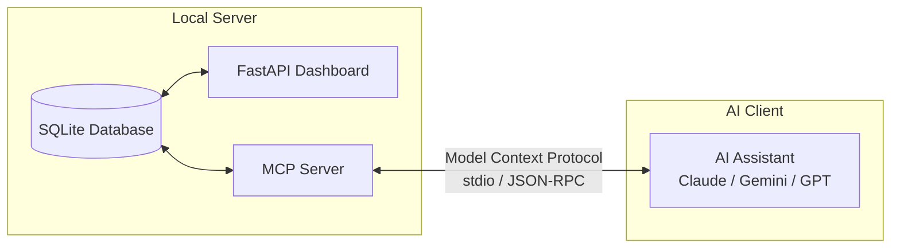

# AI Coach & MCP Integration Guide

The Athlytics **AI Coach** transforms state-of-the-art AI assistants (Claude, Google Gemini, ChatGPT, Cursor) into an evidence-based personal sports scientist and health coach connected directly to your local health data via the **Model Context Protocol (MCP)**.

---

## 📋 Table of Contents

1. [How the AI Coach Works](#how-the-ai-coach-works)
2. [Setting Up Your AI Client](#setting-up-your-ai-client)
   - [Claude Desktop](#claude-desktop)
   - [Claude Code](#claude-code)
   - [Google Gemini CLI & Antigravity](#google-gemini-cli--antigravity)
   - [ChatGPT Custom GPTs / Gemini Studio / Cursor](#chatgpt-custom-gpts--gemini-studio--cursor)
3. [Out-of-the-Box Skills & Playbooks](#out-of-the-box-skills--playbooks)
4. [MCP Tools & Living Resources Reference](#mcp-tools--living-resources-reference)
5. [Prompting Your AI Coach (Copy-Paste Examples)](#prompting-your-ai-coach-copy-paste-examples)

---

## 🧠 How the AI Coach Works

Unlike typical fitness chatbots that guess without context, Athlytics provides **bidirectional, evidence-based integration**:



- **Living Context Resources (`athlytics://`)**: Provides your AI with instant access to your 7-day health snapshot, current training plan, and athlete profile without needing manual data entry.
- **Actionable MCP Tools**: Allows your AI to query rolling trends, detect statistical anomalies, trigger provider syncs, set dashboard targets, build periodized training plans, and log qualitative notes.
- **Strict Evidence-Based Principles**: Guardrails for recovery-gated intensity, the 10% volume progression rule, structured deloads, and progressive overload.

---

## ⚙️ Setting Up Your AI Client

### Claude Desktop

Add the Athlytics server to your Claude Desktop configuration file:
- **macOS**: `~/Library/Application Support/Claude/claude_desktop_config.json`
- **Windows**: `%APPDATA%\Claude\claude_desktop_config.json`

```json
{
  "mcpServers": {
    "athlytics": {
      "command": "docker",
      "args": ["exec", "-i", "athlytics", "python", "-m", "mcp_server.server"]
    }
  }
}
```

*(Note: Ensure your Athlytics container is running with `docker compose up -d`)*.

### Claude Code

Run this single command from your terminal:

```bash
claude mcp add athlytics -- docker exec -i athlytics python -m mcp_server.server
```

### Google Gemini CLI & Antigravity

Add the server definition to `~/.gemini/config/mcp_config.json` or your project `.agents/mcp_config.json`:

```json
{
  "mcpServers": {
    "athlytics": {
      "command": "docker",
      "args": ["exec", "-i", "athlytics", "python", "-m", "mcp_server.server"]
    }
  }
}
```

### ChatGPT Custom GPTs / Gemini Studio / Cursor

For web-based AI clients or IDE assistants:
1. **System Instructions / Custom Instructions**: Copy the contents of [`skills/athlytics-coach/SKILL.md`](../skills/athlytics-coach/SKILL.md) directly into your Custom GPT or Gemini Gem instructions.
2. **Cursor / Copilot**: Add a rule to `.cursorrules` or `.github/copilot-instructions.md` referencing `skills/athlytics-coach/SKILL.md`.

---

## 📦 Out-of-the-Box Skills & Playbooks

Athlytics ships with pre-configured playbooks in the `skills/` directory (automatically recognized by Claude Code, Gemini CLI, and Antigravity):

| Skill | Description | Location |
| :--- | :--- | :--- |
| **`athlytics-coach`** | Core sports-science coaching principles (recovery gating, 10% volume rule, deloads, whole-person health). | [`skills/athlytics-coach/SKILL.md`](../skills/athlytics-coach/SKILL.md) |
| **`athlytics-setup`** | Interactive assistant guide for installing MCP, troubleshooting setups, and cross-platform sharing. | [`skills/athlytics-setup/SKILL.md`](../skills/athlytics-setup/SKILL.md) |
| **`tonal-coach`** | Progressive overload principles, muscle-group readiness bands, and the estimate-before-create rule. | [`skills/tonal-coach/SKILL.md`](../skills/tonal-coach/SKILL.md) |
| **`tonal-weekly-checkin`** | Weekly strength training review (strength-score trajectory, muscle recovery patterns, 1RM progression). | [`skills/tonal-weekly-checkin/SKILL.md`](../skills/tonal-weekly-checkin/SKILL.md) |
| **`apple-health-shortcut`**| Step-by-step instructions for creating a 1-tap iOS Shortcut to push Apple Health data to Athlytics. | [`skills/apple-health-shortcut/SKILL.md`](../skills/apple-health-shortcut/SKILL.md) |
| **`strava-provider`** | Strava API token management, deduplication rules, and troubleshooting syncs. | [`skills/strava-provider/SKILL.md`](../skills/strava-provider/SKILL.md) |

---

## 🛠️ MCP Tools & Living Resources Reference

### Living Context Resources

| Resource URI | Content Provided |
| :--- | :--- |
| `athlytics://athlete/snapshot` | 7-day rolling RHR, HRV vs baseline, recent training load, and sleep score. |
| `athlytics://training/current-state` | Active training plan, phase details, upcoming scheduled sessions, and active dashboard targets. |
| `athlytics://coach/context` | Athlete profile, historical qualitative feedback, injury history, and notes. |
| `athlytics://coach/playbook` | Core sports science principles (recovery gating, volume progression, deload cadence). |

### Read & Query Tools

- `list_metrics()`: Lists all metric types with stored data, available date ranges, and units.
- `get_metric_series(metric_type, start, end)`: Fetches raw daily readings across an ISO date range.
- `get_trend(metric_type, window=30)`: Computes rolling average and period-over-period delta.
- `get_anomalies(since=None)`: Flags readings exceeding 2 standard deviations ($|z| \ge 2.0$) from baseline.
- `get_activities(start_date, end_date, activity_type, limit)`: Fetches normalized workout sessions.
- `get_targets(status='active')`: Fetches active, completed, or abandoned targets.
- `get_training_plans(status='active')`: Fetches periodized training blocks.
- `get_coach_notes(limit=10, category=None)`: Fetches qualitative coaching and injury logs.

### Action & Write Tools

- `set_target(...)`: Creates or updates a goal tracked on the dashboard (`gte`, `lte`, `eq`).
- `delete_target(target_id)`: Removes or archives a target.
- `save_training_plan(title, goal_description, start_date, target_date, plan_json)`: Commits a structured periodized plan directly to SQLite and the web dashboard.
- `update_plan_status(plan_id, status)`: Sets plan status (`active`, `paused`, `completed`, `archived`).
- `log_coach_note(date, category, note, tags)`: Records qualitative observations (categories: `injury`, `nutrition`, `feeling`, `gear`, `milestone`, `general`).
- `sync_garmin_data(days=30, force_full_history=False)`: On-demand sync from Garmin Connect.
- `sync_strava_data(days=30, force_full_history=False)`: On-demand sync from Strava.
- `sync_mi_fitness_data(days=30, force_full_history=False)`: On-demand sync from Mi Fitness.
- `sync_tonal_data(days=30, force_full_history=False)`: On-demand sync from Tonal.

### Tonal Smart Gym Strength Tools

- `search_tonal_movements(query, muscle_group)`: Searches the 300+ movement library by muscle group.
- `get_tonal_workout_history(limit)`: Retrieves recent strength workouts.
- `get_tonal_workout_detail(activity_id)`: Details sets, reps, weight, and 1RM for a session.
- `estimate_tonal_workout(blocks)`: Safely calculates duration and set count without machine side-effects.
- `create_tonal_workout(title, blocks)`: Pushes confirmed workout program directly to the athlete's Tonal machine.
- `delete_tonal_workout(workout_id)`: Removes a custom workout from Tonal.

---

## 💬 Prompting Your AI Coach (Copy-Paste Examples)

Here are high-impact prompt templates you can copy and paste directly into your AI assistant:

### 1. 🌅 Morning Readiness & Daily Workout Check-In

```text
Good morning Coach! Please check my latest recovery snapshot in Athlytics (HRV, Resting Heart Rate, Sleep Score) and tell me if I am ready for a hard training session today or if I should take an active recovery day.
```

### 2. 📊 Weekly Training & Recovery Retrospective

```text
Let's do our weekly check-in. Review my training volume over the last 7 days against my previous 3-week average. Check if my HRV or Resting HR showed any anomalies, verify if I met my active targets, and log a coach note summarizing our review.
```

### 3. 🔍 Sickness, Fatigue, or Anomaly Investigation

```text
I've been feeling unusually sluggish during my runs this week. Can you check my anomalies in Athlytics for the past 14 days and inspect my Resting HR and Sleep Score trends to see if my body is fighting off fatigue or sickness?
```

### 4. 🧘 Whole-Person Health & Stress Audit

```text
Give me a whole-person wellness review. Scan my stress, body battery, sleep duration, and weight trends over the last 30 days. Highlight any lifestyle signals independent of my training plan.
```

### 5. 🏋️ Tonal Strength Program & Muscle Readiness

```text
I want to do an upper body workout on my Tonal today. Check my current per-muscle readiness scores for Chest, Back, Shoulders, and Triceps. Then search movements to design a balanced 35-minute push/pull session and show me the estimate before creating it.
```
