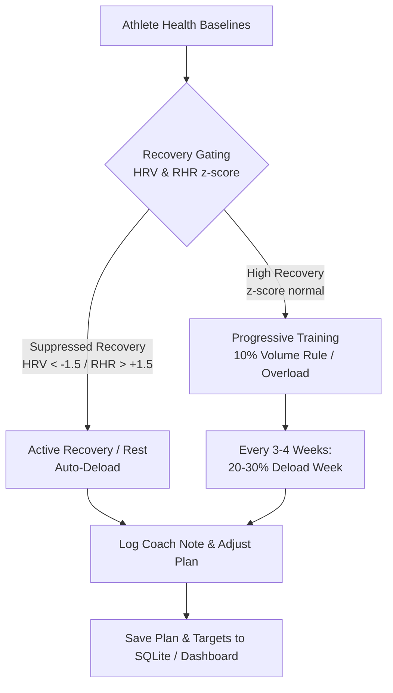

# Training Plans & Adaptive Coaching

Athlytics combines sports science principles with the reasoning power of your AI Coach to build, track, and dynamically adjust periodized training plans over time.

---

## 📋 Table of Contents

1. [Sports Science Principles](#sports-science-principles)
2. [Building a Training Plan with Your AI Coach](#building-a-training-plan-with-your-ai-coach)
3. [Training Plan Schema & Dashboard Visualization](#training-plan-schema--dashboard-visualization)
4. [Adjusting Plans Over Time (Dynamic Adaptation)](#adjusting-plans-over-time-dynamic-adaptation)
5. [Managing Plan Lifecycle & Status](#managing-plan-lifecycle--status)
6. [Mobile Access via Shareable Snapshots](#mobile-access-via-shareable-snapshots)
7. [Interactive AI Coaching Prompt Flows](#interactive-ai-coaching-prompt-flows)

---

## 🏃 Sports Science Principles

The Athlytics AI Coach follows five core, evidence-based training principles built directly into its playbooks and MCP tools:



### 1. Recovery-Gated Intensity
- Before prescribing high-intensity workouts (intervals, tempo, heavy strength lifts), the AI checks your 7-day rolling baselines via `athlytics://athlete/snapshot`.
- If your 7-day rolling **HRV z-score is $< -1.5$** or **Resting Heart Rate is $> +1.5$ standard deviations** from your 30-day baseline:
  - High-intensity sessions are automatically deferred.
  - The AI recommends Zone 1 active recovery or complete rest.
  - An observation is logged to your profile via `log_coach_note(category='feeling', ...)`.

### 2. The 10% Volume Progression Rule
- Weekly running or cycling volume should never increase by more than **10%** over the previous 3-week rolling average.
- The AI queries `get_trend('activity_distance', 21)` to verify baseline mileage before proposing weekly targets, protecting against overuse injuries.

### 3. Structured Periodization & Deload Weeks
- Every 3–4 weeks of progressive build, the AI prescribes a **Deload Week** featuring a **20–30% volume reduction**.
- This enables physiological supercompensation, muscle repair, and mental freshness before starting the next training block.

### 4. Progressive Overload for Strength Training
- For strength training (Tonal), the AI monitors One-Rep Max (`1RM`) trends and muscle-group readiness scores (0–100):
  - **< 40 (Fatigued)**: Avoid heavy working sets; prioritize recovery.
  - **40–70 (Moderate)**: Light or maintenance volume.
  - **≥ 70 (Ready)**: Clear for heavy working sets and progressive overload.

### 5. Action Persistence
- Plans and targets are not lost in chat history. Once agreed upon, the AI commits them to SQLite via `save_training_plan` and `set_target`, immediately rendering them on your web dashboard.

---

## 🛠️ Building a Training Plan with Your AI Coach

### Step 1: Baseline Review
Tell your AI Coach your goal and target race/event date. The AI reads your recent 30-day volume, active targets, and recovery baseline:

```text
"Coach, I want to train for a Half Marathon on November 15th. Check my current monthly mileage and build a 12-week periodized plan."
```

### Step 2: Periodized Block Design
The AI structures the plan into distinct physiological phases:
- **Base Phase (Weeks 1–4)**: Aerobic foundation with steady mileage progression following the 10% rule.
- **Build Phase (Weeks 5–8)**: Lactate threshold runs and tempo intervals, including a Week 6 deload.
- **Peak Phase (Weeks 9–11)**: Race-pace simulation and longest long runs.
- **Taper (Week 12)**: 40% volume reduction to maximize race-day glycogen and freshness.

### Step 3: Confirmation and Persistence
Once you review the weekly breakdown, the AI invokes `save_training_plan` and `set_target`. The new plan appears immediately on your dashboard under **Training Plans**.

---

## 📄 Training Plan Schema & Dashboard Visualization

Training plans are committed as structured JSON. Here is the canonical schema used by the AI Coach:

```json
{
  "weeks": [
    {
      "week_number": 1,
      "focus": "Aerobic Base Build",
      "target_distance_km": 35.0,
      "is_deload": false,
      "workouts": [
        {
          "day": "Monday",
          "title": "Rest / Mobility",
          "type": "rest",
          "notes": "Full recovery and 15 mins foam rolling"
        },
        {
          "day": "Tuesday",
          "title": "Easy Aerobic Run",
          "type": "running",
          "distance_km": 7.0,
          "target_hr_zone": "Zone 2",
          "notes": "Keep conversation pace"
        },
        {
          "day": "Thursday",
          "title": "Tempo Intervals",
          "type": "running",
          "distance_km": 8.0,
          "target_hr_zone": "Zone 4",
          "notes": "2km warm up, 4x1km at threshold, 2km cool down"
        },
        {
          "day": "Saturday",
          "title": "Weekend Long Run",
          "type": "running",
          "distance_km": 14.0,
          "target_hr_zone": "Zone 2",
          "notes": "Practice race fueling"
        }
      ]
    },
    {
      "week_number": 4,
      "focus": "Recovery & Adaptation Deload",
      "target_distance_km": 24.5,
      "is_deload": true,
      "workouts": [...]
    }
  ]
}
```

---

## 🔄 Adjusting Plans Over Time (Dynamic Adaptation)

Life happens: sickness, poor sleep, travel, or unexpected fatigue will inevitably occur. The AI Coach adapts your plan dynamically.

### Scenario A: Acute Fatigue or Suppressed HRV
If your morning check-in flags an HRV z-score of `-1.8`:
- **AI Action**: Temporarily swaps today's planned interval session for a 30-minute recovery walk or rest.
- **Persistence**: Calls `log_coach_note(category='feeling', note='HRV suppressed (-1.8 z-score). Swapped intervals for rest.')`.

### Scenario B: Travel or Missed Workouts
If you missed two key runs due to business travel:
- **AI Action**: Rebalances the remainder of the week without overloading weekend mileage (respecting the 10% rule rather than "cramming" missed miles).

### Scenario C: Early Deload Trigger
If training load and resting heart rate show cumulative fatigue 3 weeks into a block:
- **AI Action**: Proposes shifting the upcoming Deload Week forward by one week. Once approved, the AI updates the plan in SQLite.

---

## 🏷️ Managing Plan Lifecycle & Status

Athlytics tracks four lifecycle states for training plans:

| Status | Description | Action |
| :--- | :--- | :--- |
| `active` | The currently active training plan shown on your dashboard. | `update_plan_status(plan_id, "active")` |
| `paused` | Temporarily paused due to illness, injury, or scheduled off-season. | `update_plan_status(plan_id, "paused")` |
| `completed` | Successfully finished race or training block. | `update_plan_status(plan_id, "completed")` |
| `archived` | Superseded or replaced by a new training program. | `update_plan_status(plan_id, "archived")` |

---

## 📱 Mobile Access via Shareable Snapshots

The `/training-plans` dashboard runs on your local Athlytics server, which usually isn't reachable from your phone unless you've gone out of your way to expose it on your network. If you want to check your plan on the go, ask your AI Coach to publish a **snapshot** of it as a standalone, shareable page instead — a Claude Artifact, or any HTML file hosted somewhere reachable from your phone. It's a copy of the plan view, not a live connection to your Athlytics server, so nothing needs to be exposed to the internet for it to work.

### Creating a snapshot
Describe the plan you want captured, and ask your coach to build and publish it:

```text
"Can you publish my Rome Marathon training plan as an artifact I can check from my phone?"
```

The coach reads your live plan and target data and builds a self-contained HTML page — a lightweight version of the weekly-schedule view from the dashboard — and publishes it to a link you can save to your phone's home screen.

### Keeping it current
A snapshot is a copy, not a live view — it won't update on its own when you log a run or complete a weekly check-in. Ask your coach to refresh it as part of that flow:

```text
"After this check-in, refresh my plan artifact too."
```

Once a snapshot exists for a plan, your coach can refresh it automatically at the end of every weekly check-in from then on: it re-reads the live plan, updates the week that just closed out (actual mileage or workouts, verdict, which week is "current"), and republishes to the *same* link — so the URL you saved never changes, and you're not re-creating or re-sharing a new page every week.

### Notes
- This only happens if you've explicitly asked for a snapshot to be created — the coach won't publish one unprompted.
- A refresh updates the data, not the design — the snapshot keeps whatever visual layout was chosen when it was first built.
- Works for any plan type (running, strength) — the same mechanism applies regardless of what the plan tracks.

---

## 💬 Interactive AI Coaching Prompt Flows

### Starting a New Training Block
```text
"Coach, I just signed up for a 10K in 8 weeks. Inspect my current weekly running volume and build me an 8-week progressive plan with a deload on week 4. Save it to my Athlytics dashboard."
```

### Mid-Block Adaptation Check
```text
"I've been feeling calf tightness over the last two days and my resting heart rate was up 5 bpm this morning. Can you review my plan for the rest of this week, adjust my workouts to reduce impact, and log an injury note?"
```

### Race-Week Taper & Strategy
```text
"It's race week! Review my training load taper over the last 14 days and give me a race-day pacing strategy based on my recent race predictions and VO2 Max in Athlytics."
```
